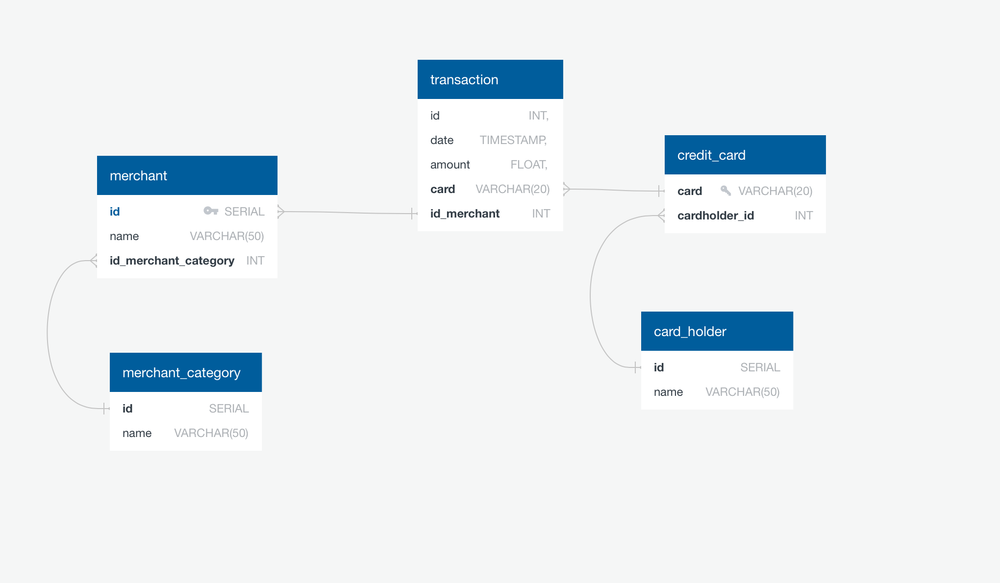
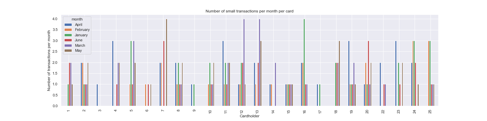
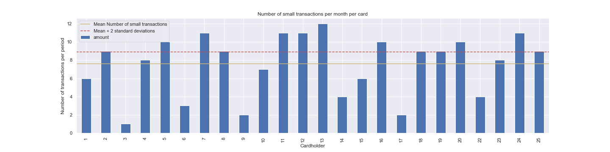
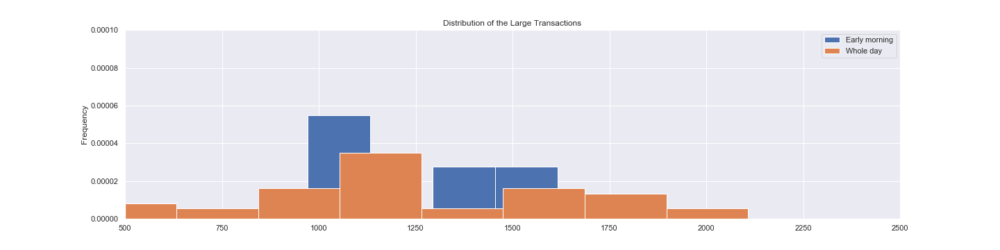
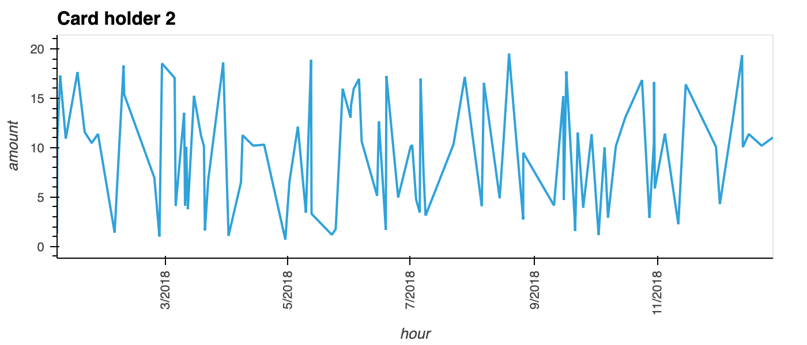
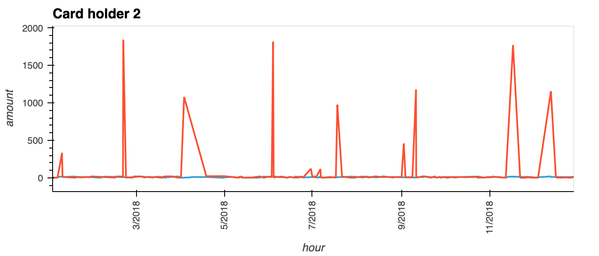
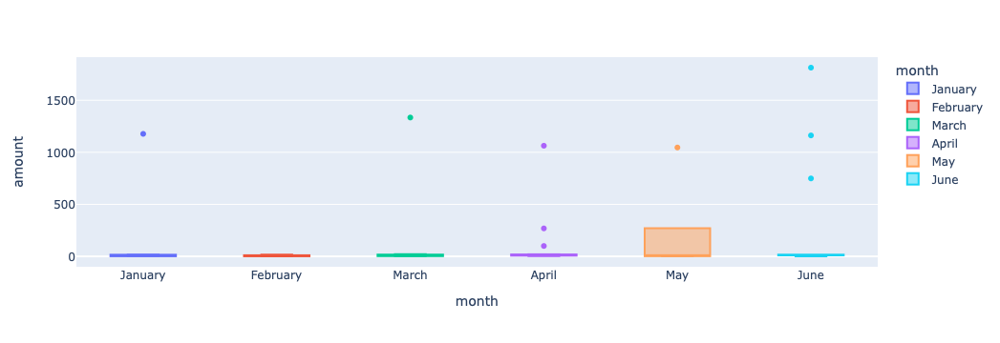

# Unit 7 Homework Assignment: Looking for Suspicious Transactions


## Files

* [schema.sql](Data/schema.sql)
* [seed_all_tables.sql](Data/seed_all_tables.sql)

## Instructions

### Data Modeling

Create an entity relationship diagram (ERD) by inspecting the provided CSV files.

Part of the challenge here is to figure out how many tables you should create, as well as what kind of relationships you need to define among the tables.
I used  the following table: 
* merchant
* merchant_type
* credit_card
* transaction

I didn't use:
* card_holder




### Data Engineering


We created the database schema, imported the data from the corresponding CSV files. In Jupyter notebook we used several queries. Few examples of queries:

* 
```
{
 SELECT cc.cardholder_id, t.date as hour, t.amount
FROM transaction AS t
JOIN credit_card AS cc ON t.card=cc.card
WHERE cc.cardholder_id=18 OR 
    cc.cardholder_id=2
}
```

* 
```
{
 SELECT EXTRACT (MONTH FROM t.date) AS MONTH,
        EXTRACT (DAY FROM t.date) AS DAY,
        t.amount
FROM transaction AS t
JOIN credit_card AS cc ON t.card=cc.card
WHERE cc.cardholder_id=25 AND
    t.date BETWEEN '2018-01-01' AND '2018-07-01'
}
```


### Data Analysis
#### Part 1:


* Some fraudsters hack a credit card by making several small transactions (generally less than $2.00), which are typically ignored by cardholders. 

  * First we isolate the transaction of each cardholder and analyze distribution of the small transactions.
  
  Qualitatively we can say: One can suspect that creditcards 7, 12, 13, and 16 were hacked because there are many small transactions.

  * We can use more quantitative creteria. in pasticular we can consider, that if number of small tansactions is more than 2-sigma larger than mean value than there is a chance that these tranasactions are fraudulent.
    
    Quantitatively we can say: that creditcards 5, 7, 11, 12, 13, 16, 20, and 24 have only 5% chance to have this number of small transactions. We suspecr that these cards should be examined closely. 
    
  
* Take your investigation a step futher by considering the time period in which potentially fraudulent transactions are made. 

  * Distribution of the transactions made between 7:00 am and 9:00 am?
    
    One can see that distribution fo the large transactions during early morning is not veru different than during the Whole Day. However, these large early morning trasactions needs to be investigated further.


  * I would like to analyse number of small stransactions during this time.
    
    We can see that distribution of the small amount transactions for early morning is different than for the remaining of the day. There is a peak around $1.5

  * During Early morning we see more potentially fraudulent transactions; both small and large. This is because during this time people are busy but awake, so transactions are possible, but people are too busy to monitor transactions.

* What are the top 5 merchants prone to being hacked using small transactions?
   


#### Part 2:

Your CFO has also requested detailed trends data on specific card holders. Use the [starter notebook](Starter_Files/challenge.ipynb) to query your database and generate visualizations that supply the requested information as follows, then add your visualizations and observations to your markdown report:      

* The two most important customers of the firm may have been hacked. Verify if there are any fraudulent transactions in their history. For privacy reasons, you only know that their cardholder IDs are 2 and 18.

  * Using hvPlot, create a line plot representing the time series of transactions over the course of the year for each cardholder separately. 
    
    
   
  
  * Next, to better compare their patterns, create a single line plot that contains both card holders' trend data.  
    
    We see that cardholder ID=2 is very active with similar trasactions. While cardholder ID=18 uses creditcard rearly for larger purchases. I don't think that each pattern can be interpreted as fraudulent. One card is everyday card, adn another card may be specific credit card, for instance with good cashback for travel, etc.


* The CEO of the biggest customer of the firm suspects that someone has used her corporate credit card without authorization in the first quarter of 2018 to pay quite expensive restaurant bills. Again, for privacy reasons, you know only that the cardholder ID in question is 25.

  * Using Plotly Express, create a box plot, representing the expenditure data from January 2018 to June 2018 for cardholder ID 25.
    
  
  * There are few outliers per month. 

  * May looks different than other months, because interquintile distance is larger. So it may be because the card was compromized. June and April have more outliers, so either there were unusual transactions, or the card was compromized. 

### Challenge

Another approach to identifying fraudulent transactions is to look for outliers in the data. Standard deviation or quartiles are often used to detect outliers.

Use the [challenge starter notebook](Starter_Files/challenge.ipynb) to code two Python functions:

* One that uses standard deviation to identify anomalies for any cardholder:

    * Std-based outliers
    ```
    {
     def find_outlier(data):
        mean_data = np.mean(data)
        std_data = np.std(data)
    
        cut_off_l = mean_data - 3 * std_data
        cut_off_u = mean_data + 3 * std_data
    
        outliers = data[(data > cut_off_u) | (data < cut_off_l)]
        return sorted(outliers)
    }
    ```
    * Examples
    

* Another that uses interquartile range to identify anomalies for any cardholder.
    * Quantile-based outliers
    ```
    {
     def find_outlier_quantile(data):


    
        q1 = np.quantile(data, 0.25)
        q3 = np.quantile(data, 0.75)
        width = (q3-q1)*1.5
        cut_off_l = q1 - width
        cut_off_u = q3 + width
        outliers = data[(data >= cut_off_u) | (data <= cut_off_l)]
        return sorted(outliers)
    }
    ```
    
    * Examples  
    
For help with outliers detection, read the following articles:


### Submission

Post a link to your GitHub repository in BootCamp Spot. The following should be included your repo:

- [x] An image file of your ERD.

- [x] The `.sql` file of your table schemata.

- [] The `.sql` file of your queries. See Next

- [x] The `.ipynb` file of your queries.

- [x] The Jupyter Notebook containing your visual data analysis.

- [x] A ReadME file containing your markdown report.

- [x] Optional:** The Jupyter Notebook containing the optional challenge assignment.

### Hint

For comparing time and dates, take a look at the [date/time functions and operators](https://www.postgresql.org/docs/8.0/functions-datetime.html) in the PostgreSQL documentation.

---
### Requirements

#### Data Modeling  (20 points)

##### To receive all points, your code must:

- [x] Define a database model. (10 points)
- [x] Use the defined model to create a PostgreSQL database. (10 points)

#### Data Engineering  (20 points)

##### To receive all points, your code must:

- [x] Create a database schema for each table and relationship. (5 points)
- [x] Specify the data types. (5 points)
- [x] Define primary keys. (5 points)
- [x] Define foreign keys. (5 points)

#### Data Analysis  (30 points)

##### To receive all points, your code must:

- [x] Identify fraudulent transactions. (10 points)
- [x] Utilize SQL and Pandas DataFrames for a report within Jupyter Notebook. (10 points)
- [x] Provide a visual data analysis of fraudulent transactions using Pandas, Plotly Express, hvPlot, and SQLAlchemy to create the visualizations. (10 points)

#### Coding Conventions and Formatting (10 points)

##### To receive all points, your code must:

- [x] Place imports at the beginning of the file, just after any module comments and docstrings and before module globals and constants. (3 points)
- [x] Name functions and variables with lowercase characters and with words separated by underscores. (2 points)
- [x] Follow Don't Repeat Yourself (DRY) principles by creating maintainable and reusable code. (3 points)
- [x] Use concise logic and creative engineering where possible. (2 points)

#### Deployment and Submission (10 points)

##### To receive all points, you must:

- [x] Submit a link to a GitHub repository that’s cloned to your local machine and contains your files. (5 points)
- [x] Include appropriate commit messages in your files. (5 points)

#### Code Comments (10 points)

##### To receive all points, your code must:

- [x] Be well commented with concise, relevant notes that other developers can understand. (10 points)

---

© 2021 Trilogy Education Services
